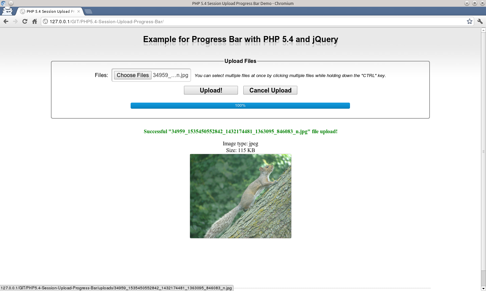

# PHP 5.4 - File Upload Progress Bar

This is an example to create a progress bar using PHP 5.4 to calculate the progress of a file being downloaded.

I also used the jQuery framework to query AJAX to know the percentage of the progress in real time.

Finally, if you want more info concerning this PHP feature, you can visit the official [PHP website](http://php.net/manual/en/session.upload-progress.php) or check my French ebook [here](http://01script.com/static/gifts/books/Barre-de-Progression-avec-PHP5.4.pdf).

## Server Requirements

PHP 5.4.0 or higher.

## Author

Pierre-Henry Soria

## Contact

By email at: *pierrehenrysoria {{AT}} gmail {{D0T}} com* or at: *ph7software {{AT}} gmail {{D0T}} com*

## License

This source code is under the license [Creative Commons Attribution 3.0](http://creativecommons.org/licenses/by/3.0/) or later; See the LICENSE.txt file.
